# Jev SEO audit: meilleurtest.fr

Audited 2026-10-01T16:04:31+00:00 · 11 URLs crawled · 11 HTML pages · 155 Jev judgments · Jev cost $0.0025

**Overall score: 88/100 (grade B)**

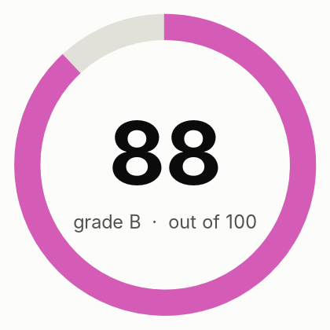

| Area | Score | Weight | How it is scored |
|---|---:|---:|---|
| Crawl and indexing | 100 | 20 | Rules only |
| On-page | 93 | 15 | Rules plus Jev findings |
| Content quality | 81 | 20 | 70% Jev judgment (helpfulness, specificity, trust), 30% rules |
| Links and architecture | 99 | 10 | Rules only |
| Structured data and sharing | 99 | 8 | Rules only |
| AI search readiness | 67 | 12 | 70% Jev judgment (citability, answer-first, entity clarity), 30% rules; editorial heuristics, since Google states no special optimization is required for AI features |
| Performance | 76 | 10 | 50% Lighthouse mobile performance, 50% crawl observations |
| Security and trust | 96 | 5 | Rules only |
| Search visibility and authority | n/a | 15 | Not assessed: run with --full (DataForSEO) |

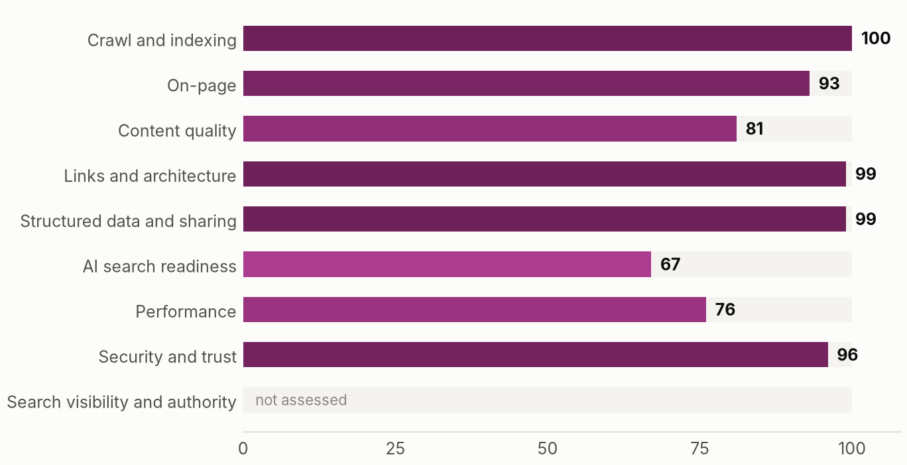

**Contents:** [Executive summary](#executive-summary) · [How this audit was made](#how-this-audit-was-made) · [Priority actions](#priority-actions) · [What the crawl found](#what-the-crawl-found) · [How Jev reads the site](#how-jev-reads-the-site) · [Findings by area](#findings-by-area) · [Robots access](#robots-access) · [Page inventory](#page-inventory) · [Method and limits](#method-and-limits)

## Executive summary

meilleurtest.fr scores 88 out of 100 (grade B) across 8 scored areas. The strongest areas are crawl and indexing, links and architecture, structured data and sharing; the weakest are AI search readiness, performance, content quality. The audit produced 13 actions, 0 of them marked fix first and 7 quick wins.

**What is working**

- Crawl and indexing scores 100.
- Links and architecture scores 99.
- Structured data and sharing scores 99.

**What is holding the site back**

- JEV-001: Pages without a meta description (1 indexable page)
- JEV-002: Low Lighthouse mobile performance score (Lighthouse mobile performance 45/100 (one synthetic load))
- JEV-003: Heading levels skipped (11 pages skip a heading level)
- JEV-004: No Strict-Transport-Security header (Homepage response has no HSTS header)

### Plan

**This week**

- JEV-001 Pages without a meta description
- JEV-003 Heading levels skipped
- JEV-004 No Strict-Transport-Security header
- JEV-005 Common security headers missing

**This month**

- JEV-002 Low Lighthouse mobile performance score
- JEV-007 Very large HTML documents (over 500 KB)
- JEV-010 Open Graph title or image missing
- JEV-011 Weak meta descriptions
- JEV-012 Main headings that do not state the topic

**This quarter**

- JEV-013 External links returning errors

_Written by: Automatic summary (no lead-agent narrative was written)._

## How this audit was made

A source finds, code decides, Jev judges, Claude writes. Code crawls, counts and scores. Jev (TypeSafe's System One model) answers narrow typed questions about meaning, with probabilities. Missing data is shown as missing.

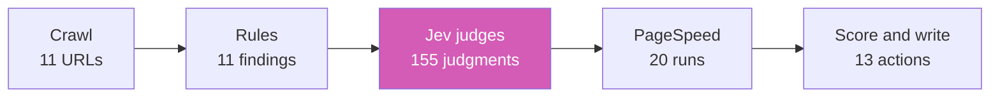

## Priority actions

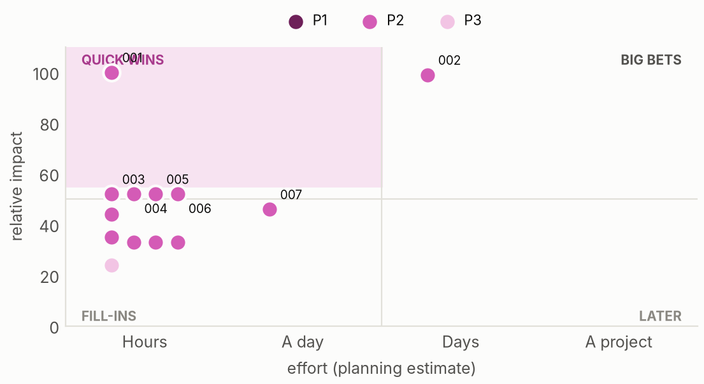

| ID | Action | Priority | Impact | Effort | Pages | By | Verify |
|---|---|---|---:|---|---:|---|---:|
| JEV-001 | Pages without a meta description (quick win) | P2 Plan next | 100 | Hours | 1 | rule |  |
| JEV-002 | Low Lighthouse mobile performance score | P2 Plan next | 99 | Several days | 1 | rule |  |
| JEV-003 | Heading levels skipped (quick win) | P2 Plan next | 52 | Hours | 11 | rule |  |
| JEV-004 | No Strict-Transport-Security header (quick win) | P2 Plan next | 52 | Hours | 1 | rule |  |
| JEV-005 | Common security headers missing (quick win) | P2 Plan next | 52 | Hours | 1 | rule |  |
| JEV-006 | Homepage does not state who, what and where plainly (quick win) | P2 Plan next | 52 | Hours | 1 | Jev judged | 1 |
| JEV-007 | Very large HTML documents (over 500 KB) | P2 Plan next | 46 | About a day | 8 | rule |  |
| JEV-008 | Pages that bury the main point (quick win) | P2 Plan next | 44 | Hours | 7 | Jev judged | 6 |
| JEV-009 | Images without width and height (quick win) | P2 Plan next | 35 | Hours | 2 | rule |  |
| JEV-010 | Open Graph title or image missing | P2 Plan next | 33 | Hours | 1 | rule |  |
| JEV-011 | Weak meta descriptions | P2 Plan next | 33 | Hours | 1 | Jev judged |  |
| JEV-012 | Main headings that do not state the topic | P2 Plan next | 33 | Hours | 1 | Jev judged | 1 |
| JEV-013 | External links returning errors | P3 When convenient | 24 | Hours | 1 | rule |  |

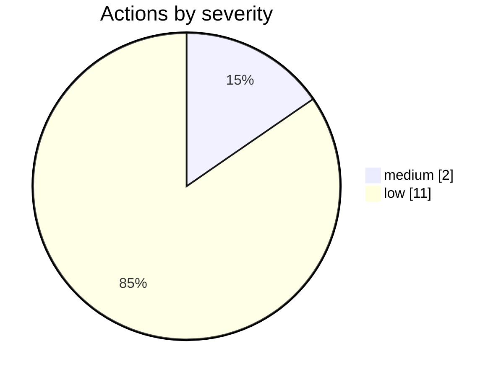

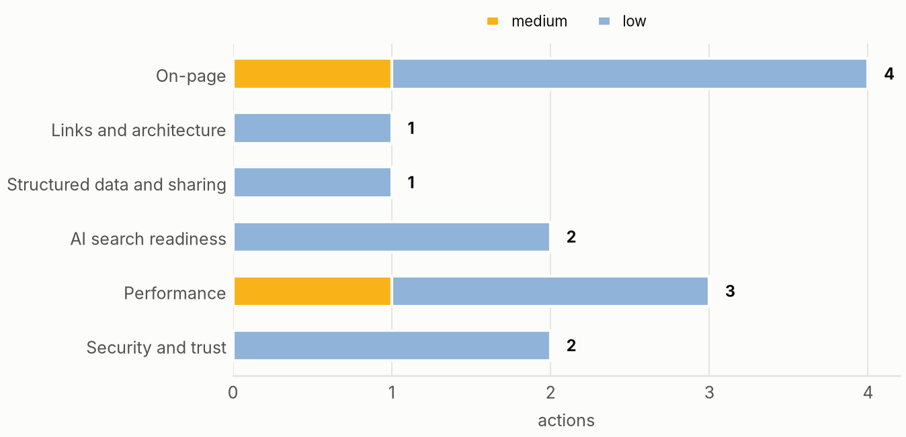

## What the crawl found

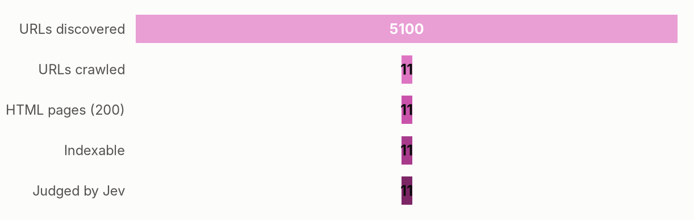

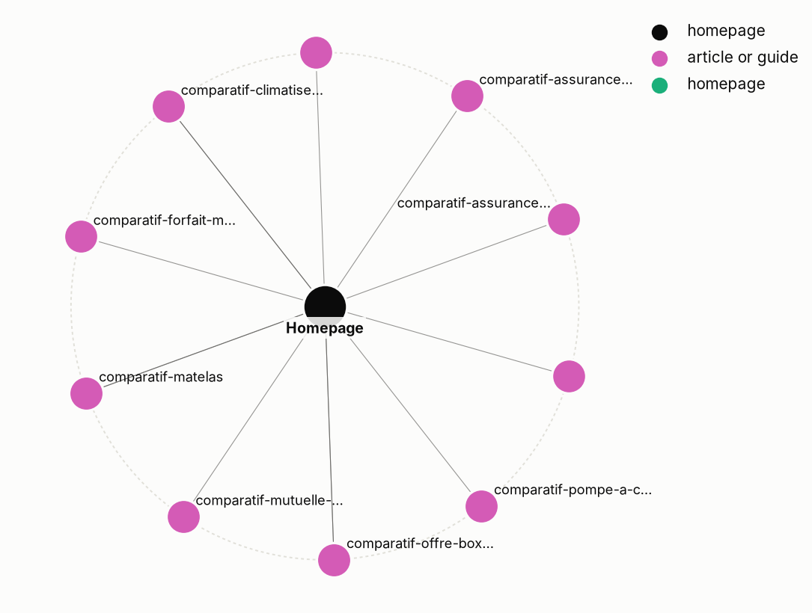

## How Jev reads the site

- **What kind of business is this?** publisher or media, confidence 1.00
- **How clear is the offer on the homepage?** 1.00, confidence 1.00
- **Does the homepage say who, what and where?** P(yes) 0.35 _(verify)_
- **How focused is the site's topic set?** 0.79, confidence 0.37 _(verify)_
- **Does it serve a specific local area?** P(yes) 0.05

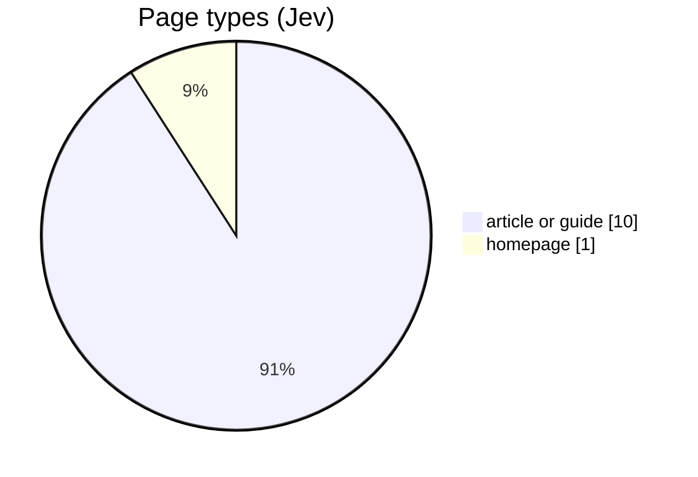

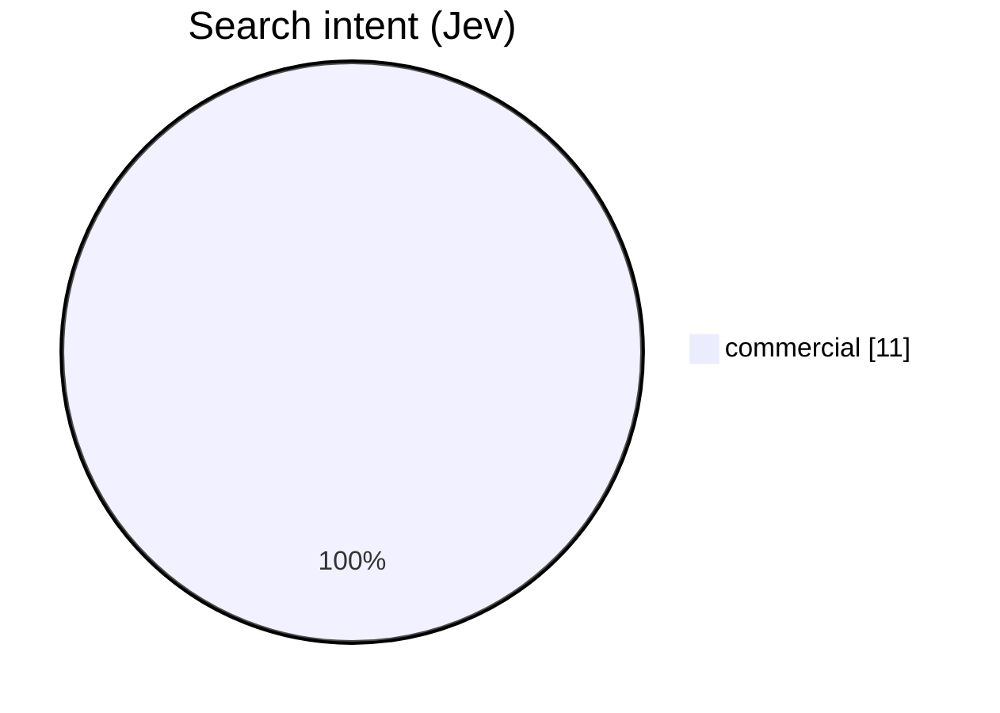

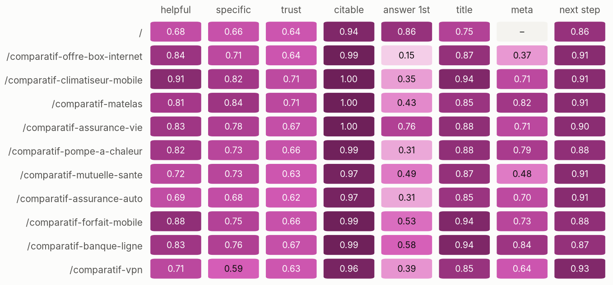

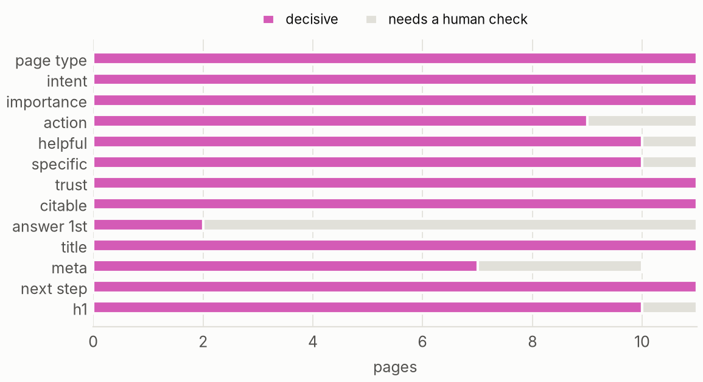

### Where to invest

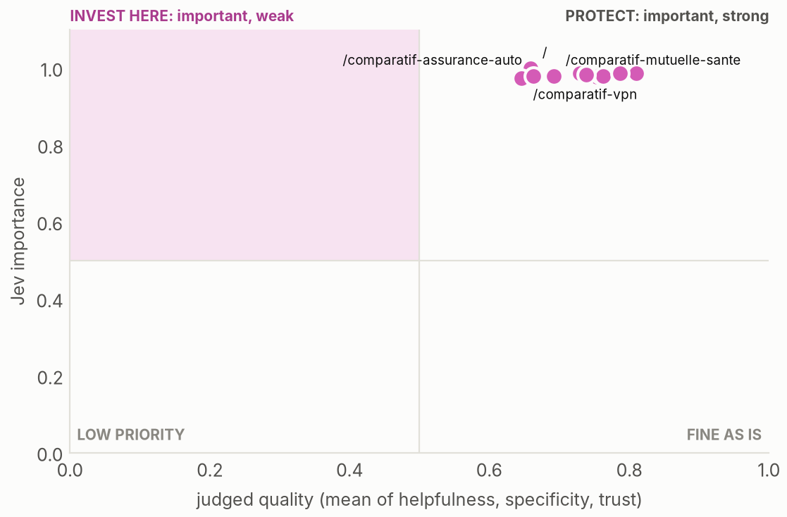

**Pages that may compete for the same searches**

| Page A | Page B | Title overlap | P(compete) |
|---|---|---:|---:|
| https://meilleurtest.fr/comparatif-assurance-vie | https://meilleurtest.fr/comparatif-mutuelle-sante | 0.43 | 0.07 |
| https://meilleurtest.fr/comparatif-mutuelle-sante | https://meilleurtest.fr/comparatif-assurance-auto | 0.43 | 0.07 |
| https://meilleurtest.fr/comparatif-assurance-vie | https://meilleurtest.fr/comparatif-assurance-auto | 0.67 | 0.05 |
| https://meilleurtest.fr/comparatif-forfait-mobile | https://meilleurtest.fr/comparatif-climatiseur-mobile | 0.67 | 0.03 |
| https://meilleurtest.fr/comparatif-vpn | https://meilleurtest.fr/comparatif-matelas | 0.6 | 0.03 |
| https://meilleurtest.fr/comparatif-assurance-vie | https://meilleurtest.fr/comparatif-pompe-a-chaleur | 0.43 | 0.03 |
| https://meilleurtest.fr/comparatif-mutuelle-sante | https://meilleurtest.fr/comparatif-pompe-a-chaleur | 0.43 | 0.03 |
| https://meilleurtest.fr/comparatif-assurance-auto | https://meilleurtest.fr/comparatif-pompe-a-chaleur | 0.43 | 0.03 |

## Findings by area

### On-page (93)

**JEV-001 · Pages without a meta description** `P2` `medium` `rule`

- Evidence: 1 affected · 1 indexable page
- Fix: Write a page-specific summary. Google may still generate its own snippet. ([source](https://developers.google.com/search/docs/appearance/snippet))
- URLs: https://meilleurtest.fr/

**JEV-003 · Heading levels skipped** `P2` `low` `rule` `heuristic`

- Evidence: 11 affected · 11 pages skip a heading level
- Fix: Nest headings in order (H2 under H1, H3 under H2). ([source](https://developers.google.com/search/docs/fundamentals/seo-starter-guide))
- URLs: https://meilleurtest.fr/, https://meilleurtest.fr/comparatif-banque-ligne, https://meilleurtest.fr/comparatif-offre-box-internet, https://meilleurtest.fr/comparatif-assurance-vie, https://meilleurtest.fr/comparatif-vpn, https://meilleurtest.fr/comparatif-mutuelle-sante, https://meilleurtest.fr/comparatif-assurance-auto, https://meilleurtest.fr/comparatif-forfait-mobile and 3 more

**JEV-011 · Weak meta descriptions** `P2` `low` `Jev judged`

- Evidence: 1 affected · Jev meta description fit averaged 0.37 (0 worst, 1 best) on 1 page: /comparatif-offre-box-internet
- Fix: Rewrite these descriptions as a specific summary of what the page delivers. ([source](https://developers.google.com/search/docs/appearance/snippet))
- URLs: https://meilleurtest.fr/comparatif-offre-box-internet

**JEV-012 · Main headings that do not state the topic** `P2` `low` `Jev judged` `1 to verify` `heuristic`

- Evidence: 1 affected · Jev P(H1 states the topic) averaged 0.23 (0 worst, 1 best) on 1 page: /
- Fix: Make the H1 name the page's topic rather than a slogan. ([source](https://developers.google.com/search/docs/fundamentals/seo-starter-guide))
- URLs: https://meilleurtest.fr/

### Links and architecture (99)

**JEV-013 · External links returning errors** `P3` `low` `rule`

- Evidence: 1 affected · 1 of 80 sampled outbound links
- Fix: Update or remove outbound links that no longer resolve. ([source](https://developers.google.com/crawling/docs/troubleshooting/http-status-codes))
- URLs: https://boutique.orange.fr/internet/autres-offres

### Structured data and sharing (99)

**JEV-010 · Open Graph title or image missing** `P2` `low` `rule`

- Evidence: 1 affected · 1 page lack og:title or og:image
- Fix: Add og:title, og:description and og:image for link previews. ([source](https://ogp.me/))
- URLs: https://meilleurtest.fr/

### AI search readiness (67)

**JEV-006 · Homepage does not state who, what and where plainly** `P2` `low` `Jev judged` `1 to verify` `heuristic`

- Evidence: 1 affected · Jev P(homepage states who, what and where) 0.35
- Fix: Say the organisation's name, what it does and its market or location in plain words near the top. Editorial heuristic: Google states no special optimization is required for its AI features. ([source](https://developers.google.com/search/docs/appearance/ai-features))
- URLs: https://meilleurtest.fr/

**JEV-008 · Pages that bury the main point** `P2` `low` `Jev judged` `6 to verify` `heuristic`

- Evidence: 7 affected · Jev P(opens with the point) averaged 0.35 (0 worst, 1 best) on 7 pages
- Fix: Open with a one or two sentence answer or offer before any preamble. Editorial heuristic for readers and answer engines, not a Google requirement. ([source](https://developers.google.com/search/docs/appearance/ai-features))
- URLs: https://meilleurtest.fr/comparatif-offre-box-internet, https://meilleurtest.fr/comparatif-vpn, https://meilleurtest.fr/comparatif-mutuelle-sante, https://meilleurtest.fr/comparatif-assurance-auto, https://meilleurtest.fr/comparatif-climatiseur-mobile, https://meilleurtest.fr/comparatif-matelas, https://meilleurtest.fr/comparatif-pompe-a-chaleur

### Performance (76)

**JEV-002 · Low Lighthouse mobile performance score** `P2` `medium` `rule`

- Evidence: 1 affected · Lighthouse mobile performance 45/100 (one synthetic load)
- Fix: Reduce render-blocking resources, image weight and JavaScript; see the PageSpeed opportunities. ([source](https://web.dev/articles/vitals))
- URLs: https://meilleurtest.fr/comparatif-matelas

**JEV-007 · Very large HTML documents (over 500 KB)** `P2` `low` `rule` `heuristic`

- Evidence: 8 affected · /comparatif-banque-ligne: 627 KB; /comparatif-offre-box-internet: 666 KB; /comparatif-assurance-vie: 501 KB; /comparatif-vpn: 499 KB; /comparatif-forfait-mobile: 811 KB; /comparatif-climatiseur-mobile: 977 KB
- Fix: Trim inline data and markup that ships with every page. ([source](https://web.dev/articles/vitals))
- URLs: https://meilleurtest.fr/comparatif-banque-ligne, https://meilleurtest.fr/comparatif-offre-box-internet, https://meilleurtest.fr/comparatif-assurance-vie, https://meilleurtest.fr/comparatif-vpn, https://meilleurtest.fr/comparatif-forfait-mobile, https://meilleurtest.fr/comparatif-climatiseur-mobile, https://meilleurtest.fr/comparatif-matelas, https://meilleurtest.fr/comparatif-pompe-a-chaleur

**JEV-009 · Images without width and height** `P2` `low` `rule`

- Evidence: 2 affected · 58 images without explicit size
- Fix: Set width and height so layout does not shift while images load. ([source](https://web.dev/articles/optimize-cls))
- URLs: https://meilleurtest.fr/comparatif-climatiseur-mobile, https://meilleurtest.fr/comparatif-matelas

### Security and trust (96)

**JEV-004 · No Strict-Transport-Security header** `P2` `low` `rule`

- Evidence: 1 affected · Homepage response has no HSTS header
- Fix: Send an HSTS header once HTTPS is stable everywhere. ([source](https://developer.mozilla.org/en-US/docs/Web/HTTP/Reference/Headers/Strict-Transport-Security))
- URLs: https://meilleurtest.fr/

**JEV-005 · Common security headers missing** `P2` `low` `rule`

- Evidence: 1 affected · Missing on the homepage response: x-content-type-options, referrer-policy, x-frame-options or CSP frame-ancestors
- Fix: Add the missing headers: x-content-type-options, referrer-policy, x-frame-options or CSP frame-ancestors. ([source](https://owasp.org/projects/secure-headers-project))
- URLs: https://meilleurtest.fr/

## Robots access

| User agent | Access |
|---|---|
| Googlebot | allowed |
| Bingbot | allowed |
| GPTBot | allowed |
| OAI-SearchBot | allowed |
| ChatGPT-User | allowed |
| ClaudeBot | allowed |
| Claude-SearchBot | allowed |
| PerplexityBot | allowed |
| Google-Extended | allowed |
| Applebot-Extended | allowed |
| CCBot | allowed |
| Bytespider | allowed |

## Page inventory

| Page | Depth | Words | Inlinks | Type (Jev) | Intent (Jev) | Importance | Action (Jev) |
|---|---:|---:|---:|---|---|---:|---|
| https://meilleurtest.fr/ | 0 | 1406 | 10 | homepage | commercial | 1.00 | keep or improve |
| https://meilleurtest.fr/comparatif-assurance-auto | 1 | 9697 | 0 | article or guide | commercial | 0.98 | keep or improve |
| https://meilleurtest.fr/comparatif-assurance-vie | 1 | 11726 | 0 | article or guide | commercial | 0.98 | keep or improve |
| https://meilleurtest.fr/comparatif-banque-ligne | 1 | 18684 | 0 | article or guide | commercial | 0.98 | keep or improve |
| https://meilleurtest.fr/comparatif-climatiseur-mobile | 1 | 35312 | 1 | article or guide | commercial | 0.99 | keep or improve |
| https://meilleurtest.fr/comparatif-forfait-mobile | 1 | 27525 | 0 | article or guide | commercial | 0.98 | keep or improve |
| https://meilleurtest.fr/comparatif-matelas | 1 | 13720 | 1 | article or guide | commercial | 0.99 | keep or improve |
| https://meilleurtest.fr/comparatif-mutuelle-sante | 1 | 9111 | 0 | article or guide | commercial | 0.98 | keep or improve |
| https://meilleurtest.fr/comparatif-offre-box-internet | 1 | 18175 | 1 | article or guide | commercial | 0.99 | keep or improve |
| https://meilleurtest.fr/comparatif-pompe-a-chaleur | 1 | 13783 | 0 | article or guide | commercial | 0.98 | keep or improve |
| https://meilleurtest.fr/comparatif-vpn | 1 | 8811 | 0 | article or guide | commercial | 0.97 | keep or improve |

## Method and limits

- Area score: 100 minus, per finding, severity amount (critical 25, high 12, medium 6, low 2) × (0.5 + 0.5 × share of pages affected). Content and AI readiness blend 70% Jev judgment with 30% rules. Performance blends 50% Lighthouse mobile with 50% crawl observations.
- Overall: weighted mean of scored areas; unscored areas are excluded, never zero.
- Impact: severity weight × (0.6 + 0.4 × reach) × (0.6 + 0.8 × highest Jev importance of affected pages), scaled to 100.
- Jev answers are decisive at confidence 0.80 (Choice, Score) or P(yes) at least 0.80 or at most 0.20 (Noul). Others are flagged to verify.
- Jev: model jev-1.13.0, 13 requests, 60497 input tokens, 0 failed, cost $0.0025.
- No Search Console, analytics, backlink or keyword data was used (run with --full for DataForSEO).
- Scores rank work; they do not predict rankings or traffic.

_Generated by jev-seo 0.1.1._
